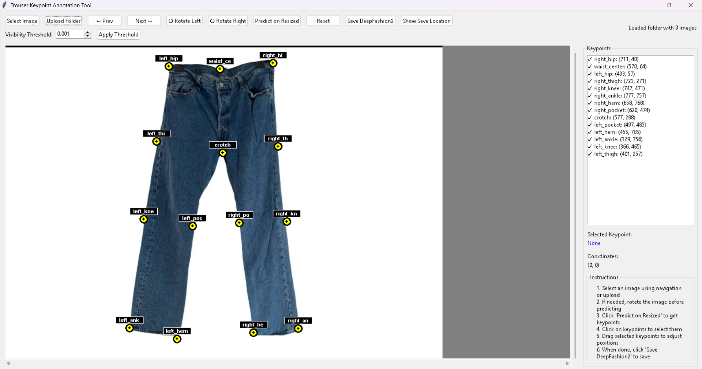
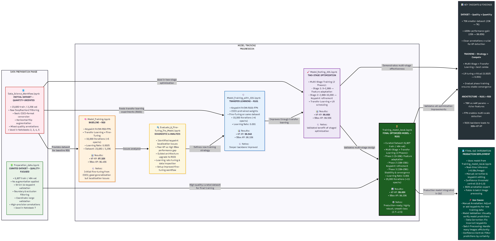

# Trousers Keypoint Detection System

*A complete end-to-end pipeline for detecting trousers keypoints using Detectron2, custom dataset engineering, multi-stage training, and a Tkinter GUI.*

---

## Project Overview

This project implements a **Trousers Keypoint Detection System** featuring:

* [**Detectron2**](https://github.com/facebookresearch/detectron2) (Keypoint R-CNN)  
* **Custom** [**DeepFashion2**](https://github.com/switchablenorms/DeepFashion2) **trousers subset**
* **Multi-stage training (R50 → R101)**
* **Final optimized model with 99%+ AP**
* **Tkinter desktop interface** for real-time predictions

Capabilities include training, evaluation, hyperparameter tuning, prediction visualization, and inference on user images.

---

## Technical Stack

| Component | Technology                          |
| --------- | ----------------------------------- |
| Framework | Detectron2 (PyTorch)                |
| Model     | Keypoint R-CNN with ResNet-101 FPN  |
| GUI       | Tkinter + OpenCV                    |
| Dataset   | Custom DeepFashion2 Trousers Subset |
| Format    | COCO-compatible annotations         |

---

## Dataset Preparation & Training

### DeepFashion2 Trousers Subset

This system is trained on a **custom trousers-only subset** of the DeepFashion2 dataset. To build this subset, the system automatically filters the original DeepFashion2 annotations and extracts only the items where category_id = 8 (Trousers). This ensures the pipeline focuses exclusively on trousers samples.


[**Phase 1 – Extraction & Augmentation**](https://github.com/Abd-Rahim1/Trouser-Keypoint-Detection-System/blob/main/notebooks/data_preparation/Preparation_data_with_aug.ipynb)

* 53,644 training + 9,118 validation images
* Filtered occlusions ≥2, invalid boxes, missing keypoints
* Resized to 256×256, normalized
* Horizontal flip doubled dataset
* Result: 23,683 training + 2,206 validation images

---

[**Phase 4.1 – High-Quality Dataset**](https://github.com/Abd-Rahim1/Trouser-Keypoint-Detection-System/blob/main/notebooks/data_preparation/Preparation_data_without_aug.ipynb)

* Retain samples with 14 visible keypoints
* Remove heavily occluded/poorly annotated samples
* Crop, resize, normalize
* Result: 6,907 training + 484 validation (11.8% retention)

**Dataset Summary:**

| Metric     | Phase 1 | Phase 4.1    | Improvement         |
| ---------- | ------- | ------------ | ------------------- |
| Samples    | 25,889  | 7,391        | 71.5% reduction     |
| Keypoints  | Mixed   | 14/14        | Perfect consistency |
| Annotation | Noisy   | High-quality | 400% AP improvement |
| Occlusion  | Partial | Removed      | Stable              |

**Keypoints (14 landmarks):**

```
["left_hip", "right_hip", "left_knee", "right_knee",
 "left_ankle", "right_ankle", "left_pocket", "right_pocket",
 "waist_center", "crotch", "left_thigh", "right_thigh",
 "left_hem", "right_hem"]
```

**Processing Pipeline:**
Category Filtering → Keypoint Validation → Quality Control → Preprocessing → COCO Conversion → Dataset Registration

---

## Training Strategy

### [Phase 2 – Baseline](https://github.com/Abd-Rahim1/Trouser-Keypoint-Detection-System/blob/main/notebooks/training_r50/Model_Training_50.ipynb)

**Objective:** Establish performance baseline and identify fundamental challenges

**Configuration:**  
- **Architecture:** Keypoint R-CNN with ResNet-50 FPN backbone  
- **Training:** From scratch (no pretrained weights)  
- **Dataset:** Unfiltered DeepFashion2 trousers (23,683 training samples)  

**Key Findings:**  
- Poor Convergence: Unstable training with fluctuating losses  
- Low Accuracy: 19.83% AP indicating fundamental data quality issues  
- Insight: Model struggled with inconsistent annotations and missing keypoints  

**Conclusion:** Demonstrated critical need for data cleaning and architectural enhancement

---

### [Phase 3 – Architecture Enhancement](https://github.com/Abd-Rahim1/Trouser-Keypoint-Detection-System/blob/main/notebooks/training_r101/Model_Training_101.ipynb)  

**Objective:** Validate architectural improvements and pretraining benefits

**Configuration:**  
- **Architecture:** ResNet-101 FPN with Feature Pyramid Network  
- **Training:** COCO-pretrained weights for better initialization  
- **Dataset:** Same noisy dataset for controlled comparison  

**Key Findings:**  
- Immediate Improvement: ~30% AP (50% increase from baseline)  
- Faster Convergence: Pretrained weights accelerated learning  
- Architectural Benefit: ResNet-101 demonstrated superior feature extraction  
- Insight: Confirmed architectural superiority but highlighted data limitations

---

### [Phase 4.2 – Optimized Final Model](https://github.com/Abd-Rahim1/Trouser-Keypoint-Detection-System/blob/main/notebooks/final_training/Final_Training_with_Improved_Dataset.ipynb) 

**Objective:** Achieve production-ready performance through data optimization and extended training

**Configuration:**  
- **Architecture:** ResNet-101 FPN with enhanced keypoint head  
- **Training:** COCO-pretrained + systematic hyperparameter tuning  
- **Dataset:** High-quality filtered subset (6,907 training, 484 validation)  

**Breakthrough Results:**  
- State-of-the-Art Accuracy: 99.851% Keypoint AP  
- Optimal Loss: 2.537 total loss (47% reduction from baseline)  

**Precision Metrics:**  
- **AP50:** 99.988% | **AP75:** 99.988%  
- **Average Recall:** 99.90%  
- **Object Size Performance:** 99.10% (medium), 99.856% (large)  
- **Training Stability:** Smooth convergence with no overfitting


**Training Progression Overview**

| Phase | Model    | Dataset      | Pretrained | Iterations | Keypoint AP | Total Loss |
| ----- | -------- | ------------ | ---------- | ---------- | ----------- | ---------- |
| 2     | R50 FPN  | Noisy (~23K) | No         | 10,000     | 19.83%      | 4.812      |
| 3     | R101 FPN | Noisy (~23K) | Yes        | 3,000      | ~30%        | ~3.90      |
| 4.2   | R101 FPN | Clean (~7K)  | Yes        | 20,000     | 99.851%     | 2.537      |

**Hyperparameters (Final Model):**

| Parameter      | Value           | Purpose                     |
| -------------- | --------------- | --------------------------- |
| Learning Rate  | 0.001           | Stable convergence          |
| Batch Size     | 4               | Memory optimization         |
| Optimizer      | SGD             | Proven for detection        |
| Max Iterations | 20,000          | Extended refinement         |
| Scheduler      | Warmup + StepLR | Gradual learning            |
| ROI Batch Size | 512             | Sufficient positive samples |

**Performance Metrics:**

| Metric                  | Score   | Improvement |
| ----------------------- | ------- | ----------- |
| Keypoint AP@[0.50:0.95] | 99.851% | +404%       |
| Keypoint AP50           | 99.988% | +69%        |
| Keypoint AP75           | 99.988% | +2393%      |
| BBox AP@[0.50:0.95]     | 90.202% | Stable      |
| Average Recall          | 99.90%  | +216%       |

---

## GUI Interface (Tkinter)

**Annotation Tool** – Fast, precise keypoint annotation and correction.

**Home UI:**


**Prediction UI:**



**Key Features:**

* Image Management: Single/batch upload, navigation, rotation, zoom
* Model Integration: One-click inference, confidence threshold, GPU acceleration
* Manual Adjustment: Smart keypoint selection, drag & drop, sub-pixel precision, undo/reset
* Auto-Load: Detect existing annotations, version management, session preservation
* Export: COCO-compatible JSON, metadata, timestamps, validation flags

---

## Workflow Pipeline



---

## Environment Setup

### Create Conda Environment

```bash
# 1. Create and activate environment
conda create -n detectron-env python=3.10 -y
conda activate detectron-env

# 2. Install Detectron2 directly from GitHub in editable mode
pip install -e git+https://github.com/facebookresearch/detectron2.git@main#egg=detectron2

# 3. Install all other dependencies from requirements.txt
pip install -r requirements.txt

# 4. Set PYTHONPATH for Detectron2 (PowerShell)
$env:PYTHONPATH="/path/to/detectron2"

# 5. Test the setup
python configs/test_setup.py
```

### Running Tkinter Application

```bash
python  src\main.py
```

## License

MIT License

## Author

Abd Rahim Mojbani
AI & Software Engineering Student
